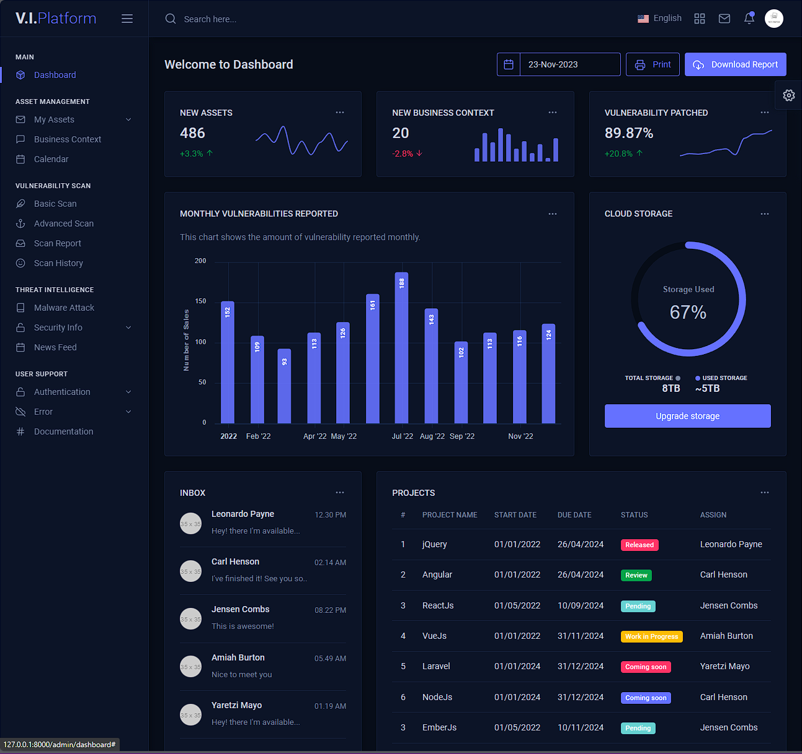

## About This Project

The Vulnerability Intelligence Platform is a single unified system to streamline cybersecurity efforts. Aiming to integrate threat modelling, automated decision-making, contextual vulnerability management, and customizable dashboards.

Aims:

- Threat Modelling
- Automating Decision-making Process
- Contextual Vulnerability Management
- Customizable Dashboard
- Asset Inventory & CMDB
- Flexible Scanning Methods
- Easy Mitigation & Patching
- User-friendly UI

